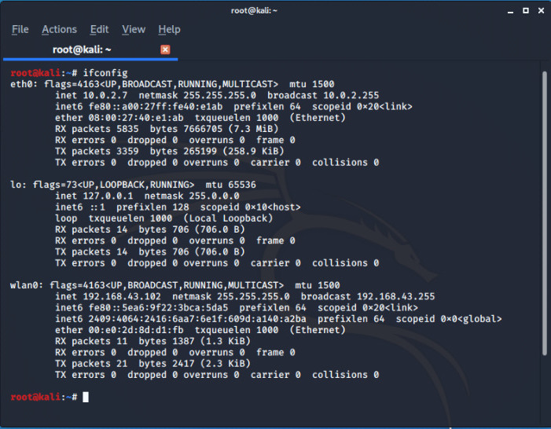
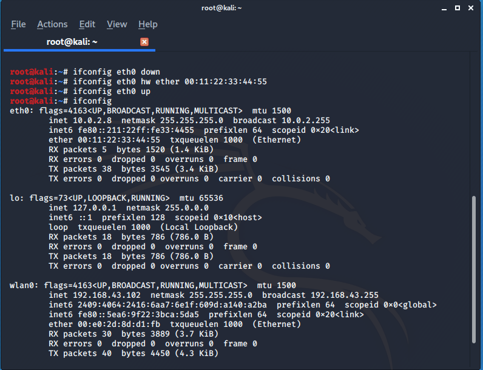
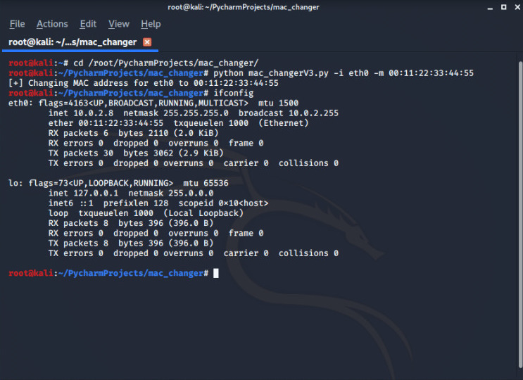
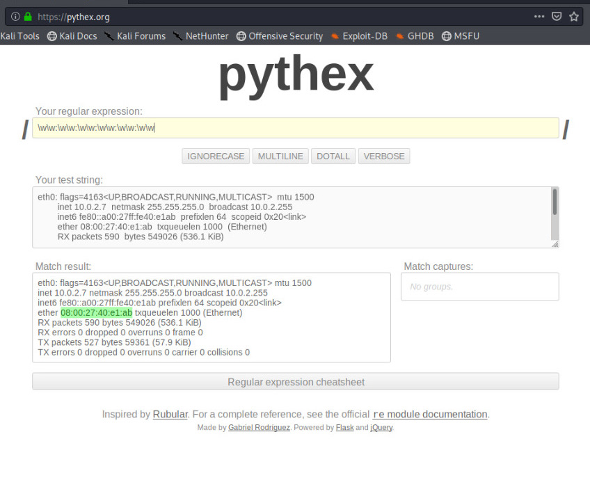
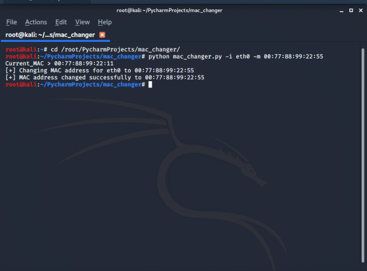

# BUILD A MAC CHANGER TOOL (PYTHON)

Let's first discuss on MAC Address in brief , so  MAC stands for <mark> Media Access Control </mark> which is :

- Unique
- Permanent
- Physical and **Assigned By Manufacturer**

###### So why we need to change our MAC Adress ?

> The answer is very simple :

- Increase Anonmity
- Impersonate other device
- ByPass Filters

---

You can know your machine MAC Address in many ways but simplest way is just type **ifconfig** in bash:

```bash

root@kali:~# ifconfig

```



**ether represents the MAC Address** and **eth0** has  MAC Address of your system.

##### So here comes the main motive how to change it ?

It's very simple  either use the tool **macchanger** or do it manually by:

```bash

root@kali:~# ifconfig eth0 down

root@kali:~# ifconfig eth0 hw ether 00:11:22:33:44:55

root@kali:~# ifconfig eth0 up

```

AND NOW THE NEW MAC ADDRESS FOR eth0 is


It's just very simple process three line commands and your MAC Address can be changes just remember to enter a valid Mac Address 12 digits alphanumeric character each two digits seprated by : and you can also chnage the Mac address for your wlan0 interface if you are using a wifi adapter.

##### So Let's Begin with How to make our own MAC Changer Tool using Python

**You need a basic knowledge of python and some determination to learn something new**


So what we actually need is to run our system commands to read and manipulate the value of **ether** in the code and want to take inputs for interface and new MAC Address in the terminal.

Our problems have very simple solutions we just need to import some Python modules to do it for us.

The first one  is **subprocess** which helps to execute system commands


Syntax (for subprocess):
```python
       import subprocess
       subprocess.call("COMMAND", shell=TRUE)
```
you can see [official documentation](https://docs.python.org/2/library/subprocess.html) to learn more on subprocess, and to take inputs in terminal **optparse** is going to help us for this you can also see the [official documentation](https://docs.python.org/3/library/optparse.html).

Use your desired "Text-editor" I use Pycharm if you want to use this you can [download](https://www.jetbrains.com/pycharm/download/#section=mac) the community version from here.

Create a file "mac_changer.py" and go with the flow

```python
#!/usr/bin/env python

import  subprocess
import optparse

def get_arguments():
    parser = optparse.OptionParser()
    parser.add_option("-i", "--interface", dest="interface", help="Interface to change MAC Address")
    parser.add_option("-m", "--mac", dest="new_mac", help="New MAC Address")
    (options, arguments) =  parser.parse_args()
    if not options.interface:
        parser.error("[-] Please specify a interface use --help for more info")
    elif not options.new_mac:
        parser.error("[-] Please specify a MAC address  use --help for more info")
    return options
```

>So above code is quite simple we defined a function to  get arguments from user by using optparse we are adding options (-i for interface and -m for new MAC) and using conditional statements for error handling.

Let's add some more code to make perform some main action.


```python
#!/usr/bin/env python

import  subprocess
import optparse

def get_arguments():
    parser = optparse.OptionParser()
    parser.add_option("-i", "--interface", dest="interface", help="Interface to change MAC Address")
    parser.add_option("-m", "--mac", dest="new_mac", help="New MAC Address")
    (options, arguments) =  parser.parse_args()
    if not options.interface:
        parser.error("[-] Please specify a interface use --help for more info")
    elif not options.new_mac:
        parser.error("[-] Please specify a MAC address  use --help for more info")
    return options

def mac_changer(interface, new_mac):
    print("[+] Changing MAC address for " + interface + " to " + new_mac)
    subprocess.call(["ifconfig", interface, "down"])
    subprocess.call(["ifconfig", interface, "hw", "ether", new_mac])
    subprocess.call(["ifconfig", interface, "up"])

options = get_arguments()
mac_changer(options.interface, options.new_mac)

```
>Again we defined a function to change MAC Address using functions in your increase code re-usability and debugging little easier the above code is nothing but system commands to change MAC added in optparse syntax in last two lines we are calling function for getting arguments and  changing MAC.

So it's done you can give shot to check your tool.




Our code is just fine running smoothly . But what if the user not enters a valid MAC Address? **We need to set a validation rule for our MAC** to make our tool more perfect and we also need to confirm  that aur MAC Address is changing.

To get over this we are going to use one new module [Regex](https://docs.python.org/3/library/re.html) to match the regular expressions of MAC Address if you look any normal MAC Address its a 12 digit alphanumeric and seperated by colon you can use a very helpful website to create general expressions for MAC Address it's [Pythex](https://pythex.org/).Where you will found \w is used for matching alphanumeric.

So if try to match it you would get a expressions like this


Now we get our desired expressions lets write some code.  

```python
def get_current_mac(interface):
    ifconfig_result = subprocess.check_output(["ifconfig", options.interface])
    mac_address_search_result = re.search(r"\w\w:\w\w:\w\w:\w\w:\w\w:\w\w", ifconfig_result)

    if mac_address_search_result:
        return mac_address_search_result.group(0)
    else:
        print("[-] Could not read a MAC Address")


```

Code is simple and sweet get_current_mac function helps to get the Current MAC and we compare that with our new MAC to confirm our actions that MAC Address changed successfully or not and if  you don't get the this 'group(0)'

```python
return mac_address_search_result.group(0)
#(group(0) is just to get the first expression  if there is any similar kinds of expressions in that whole expressions)

```

Use some conditional statements to refactor the entire code

```python

#!/usr/bin/env python

import  subprocess
import optparse
import re

def get_arguments():
    parser = optparse.OptionParser()
    parser.add_option("-i", "--interface", dest="interface", help="Interface to change MAC Address")
    parser.add_option("-m", "--mac", dest="new_mac", help="New MAC Address")
    (options, arguments) =  parser.parse_args()
    if not options.interface:
        parser.error("[-] Please specify a interface use --help for more info")
    elif not options.new_mac:
        parser.error("[-] Please specify a MAC address  use --help for more info")
    return options

def mac_changer(interface, new_mac):
    print("[+] Changing MAC address for " + interface + " to " + new_mac)
    subprocess.call(["ifconfig", interface, "down"])
    subprocess.call(["ifconfig", interface, "hw", "ether", new_mac])
    subprocess.call(["ifconfig", interface, "up"])


def get_current_mac(interface):
    ifconfig_result = subprocess.check_output(["ifconfig", options.interface])
    mac_address_search_result = re.search(r"\w\w:\w\w:\w\w:\w\w:\w\w:\w\w", ifconfig_result)

    if mac_address_search_result:
        return mac_address_search_result.group(0)
    else:
        print("[-] Could not read a MAC Address")


options = get_arguments()
current_mac = get_current_mac(options.interface)
print("Current_MAC > " + str(current_mac))

mac_changer(options.interface, options.new_mac)

current_mac = get_current_mac(options.interface)
if current_mac == options.new_mac:
    print("[+] MAC address changed successfully to " + current_mac)
else:
    print("[-] MAC not chnaged")

```

Give a shot to your perfect Tool by : 

```
root@kali:~# python mac_changer.py -i (interface_name) -m (new MAC Address)

```




**Author** - [ERROR](https://github.com/Error-200)
